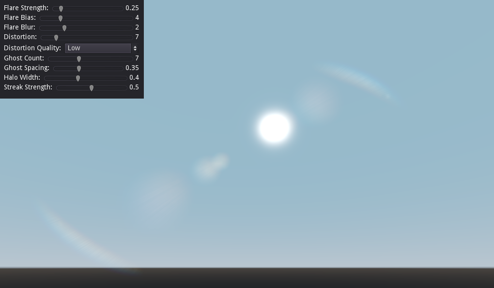

# Godot-Lens-Flare-Plugin

Hello and thank you for using the Lens Flare Plugin for Godot 3.2.

## What is this?

This plugin does not provide your ordinary realtime lens flares. These flares are _procedural_. They are made like bloom. They read bright spots on the screen and create the effect accordingly.

## Installation

You must move the addons folder here into the root of your project. You should then go to the `Project Settings` and enable it there.

Once enabled, you should add a new node called Lens Flare. As soon as the node is in your scene the lens flare effect should be visible in the 3d editor.

## Instructions

As you may have seen in the asset store where you may have downloaded it, the plugin's node comes with some properties to customize the effect.

- `Flare Strength`: Controls how strong the effect is.
- `Flare Bias`: Controls the filtering of bright points on the screen; which determines how much of screen will be used in the lens flare effect.
- `Flare Blur`: Sort of softens the flares. The flare bias should be reduced when increasing this.
- `Distortion`: Controls how much colour distortion is made on the flares.
- `Distortion Quality`: Determines the quality of the distortion.
- `Ghost Count`: Controls how many "ghosts" appear on the screen.
- `Ghost Spacing`: Controls the distance between ghosts.
- `Halo Width`: Controls the radius of the halo.
- `Streak Strength`: How strongly streaks appear in the effect.
- `Lens Dirt`: The texture gets modulated with the final effect making it look a little dirty. The default texture should be fine.
