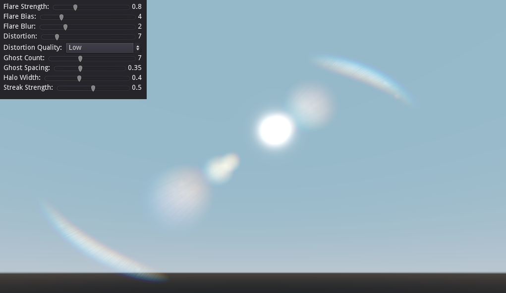
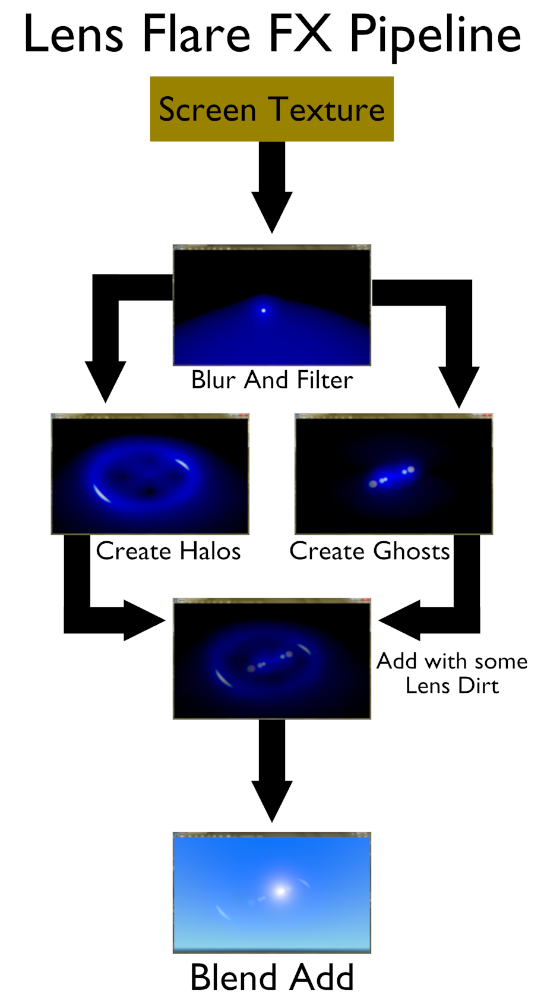
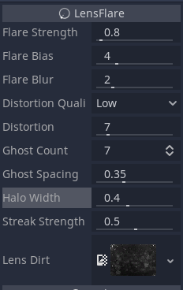

# Godot-Lens-Flare-Plugin

Hello and thank you for using the Lens Flare Plugin for Godot 3.2.

## What this is

This plugin does not provide your ordinary realtime lens flares. These flares are _procedural_. They are made like bloom. They read bright spots on the screen and create the effect accordingly. Since it uses bright spots, it's recommended that you use this with an HDR viewport. GLES 2 doesn't support that however, but the addon will still work with it anyway (Not recommended though).

## Installation

_This plugin is available in the asset library._

You must move the addons folder here into the root of your project. You should then go to the `Project Settings` and enable the plugin.

Once enabled, you should add a new node called `LensFlare`. As soon as the node is in your scene, the lens flare effect should be visible in the 3d editor, as long as there's a bright spot in view.

## Instructions

The plugin's node comes with some properties to customize the effect.

- `Flare Strength`: Controls how strong the effect is.
- `Flare Bias`: Controls the filtering of bright points on the screen; which determines how much of screen will be used in the lens flare effect.
- `Flare Blur`: Sort of softens the flares. It's suggested that you lower the flare bias when increasing this setting.
- `Distortion`: Controls how much colour distortion is made on the flares.
- `Distortion Quality`: Determines the quality of the distortion.
- `Ghost Count`: Controls how many "ghosts" appear on the screen.
- `Ghost Spacing`: Controls the distance between ghosts.
- `Halo Width`: Controls the radius of the halo.
- `Streak Strength`: How strongly streaks appear in the effect.
- `Lens Dirt`: The texture gets modulated with the final effect making it look a little dirty. The default texture should be fine.
